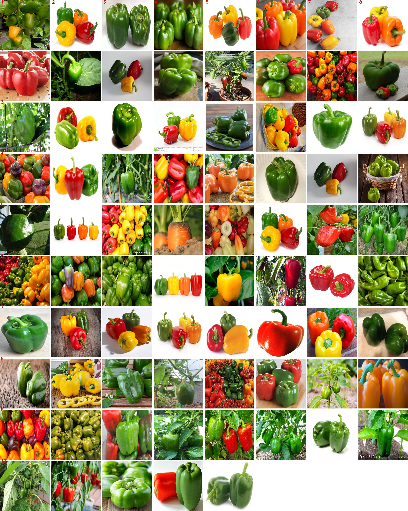
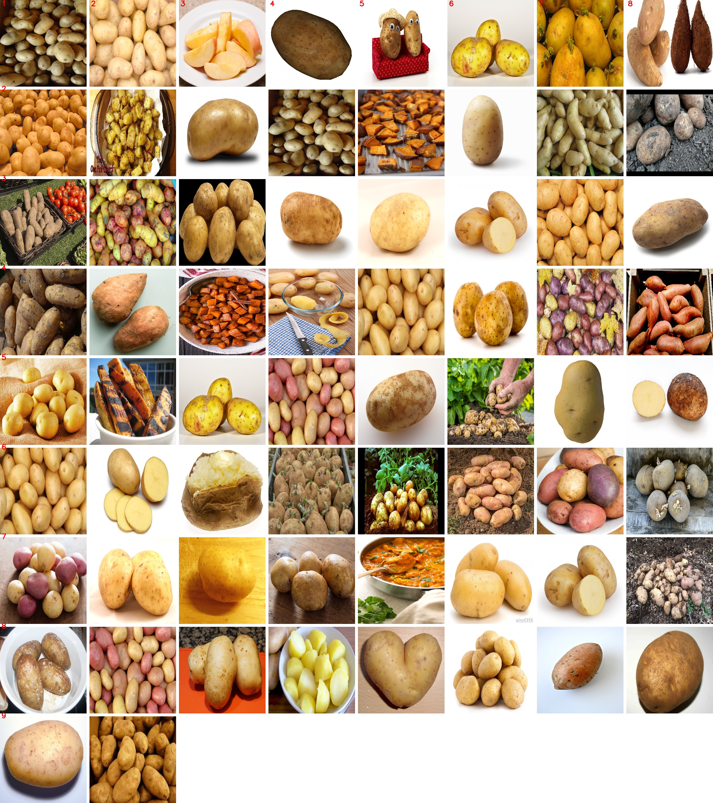
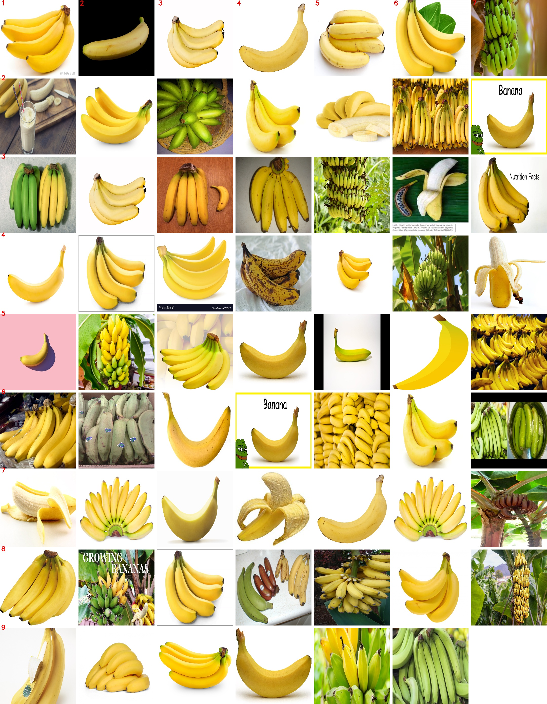
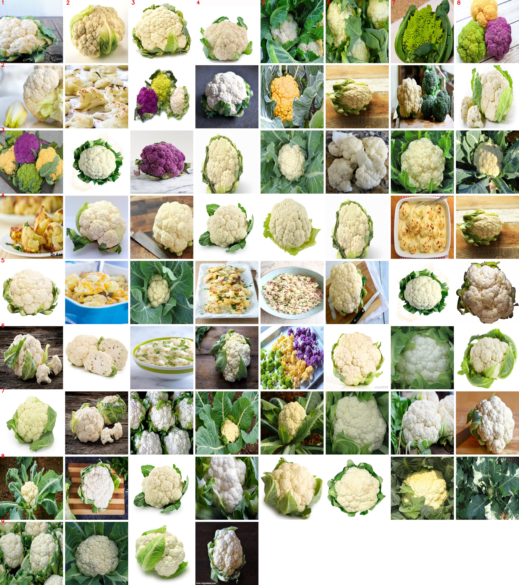
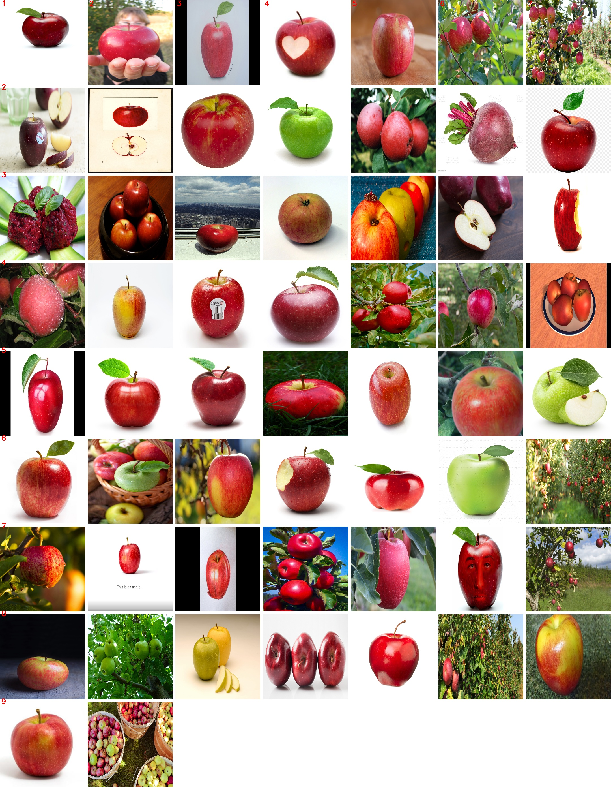
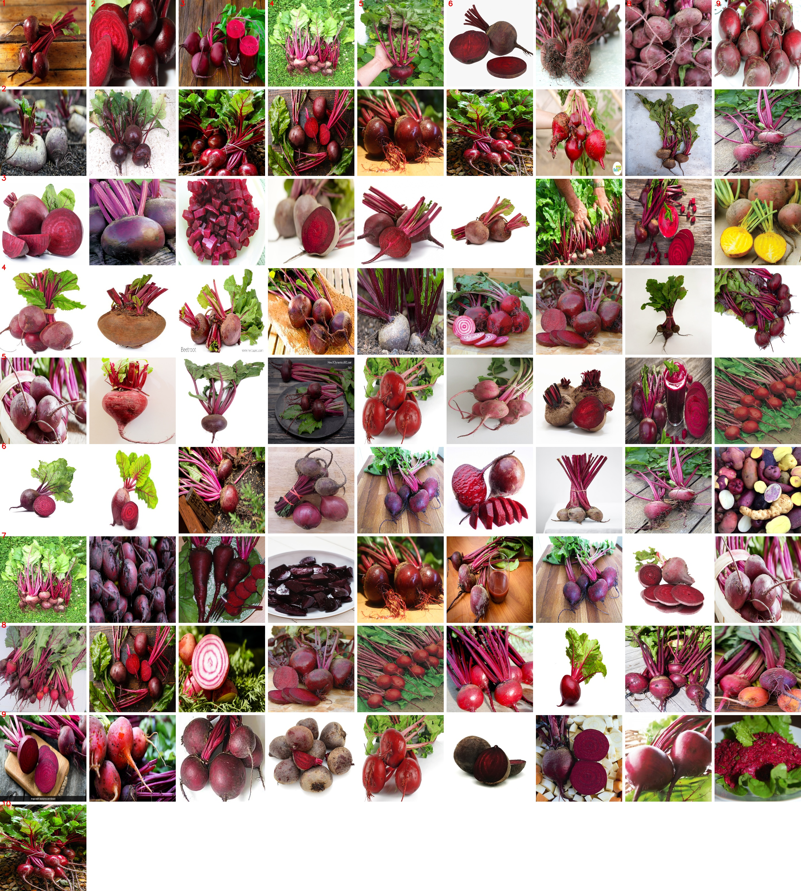
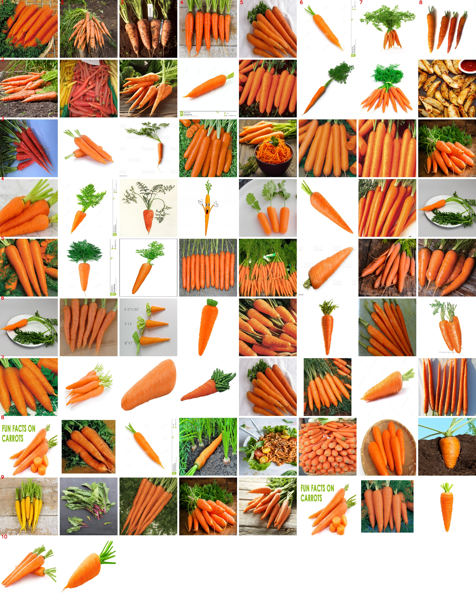

# Image Clustering and Grid Creation

## Overview

This project focuses on organizing and visualizing a collection of images using state-of-the-art deep learning models. It uses deep learning models to extract features from images, which are then used to cluster the images into groups based on visual similarity. The resulting clusters are represented both through the creation of folders containing the clustered images and visually through composite grid images.

This is particularly useful for applications involving large datasets of images where manual sorting and organization would be impractical. By automatically grouping similar images, it helps in data management, curation, and analysis tasks.

| Model's Supported        |
|--------------------------|
| Vision Transformer (ViT) |
| ResNet-50                |
| VGG-16                   |
| MobileNet-V3             |
| CLIP                     |
|DINO V2                   |
|SWIN(V2) Transformer      |

### Key Features:
- **Feature Extraction:** Utilizes pre-trained deep learning models to extract features from images.
- **Clustering:** Implements clustering algorithms such as KMeans and Gaussian Mixture Models (GMM) to categorize images based on their features.
- **Visualization:** Provides an intuitive visualization of the clustering results through grid images.
- **Data Management:** Automates the organization of images into directory structures for easy access and analysis.

The tool is designed to be flexible, allowing users to choose between different models and clustering methods, and to either calculate features on the fly or use precomputed ones.

### Reusing Precomputed Features
To avoid recomputing features every time you adjust the number of clusters or clustering method, the program saves the extracted features in a pickle file. You can enable this feature by setting the appropriate flag in the code to load precomputed features:

## Usage

### Prerequisites
Ensure all dependencies are installed using the following command:

```pip install -r requirements.txt```

To install the OpenAI's clip module, use the following command:

````pip install git+https://github.com/openai/CLIP.git````

### Running the Script
```
python3 cluster_images.py --image_dataset_path <path_to_image_dataset> \
                      --grid_folder <path_to_save_grid_images> \
                      --cluster_folder <path_to_save_clustered_images> \
                      --feature_dict_path <path_to_save_or_load_feature_dict> \
                      --num_clusters <number_of_clusters> \
                      --model <model_type> \
                      --clustering_method <clustering_method> \
                      --device <device name> \
                      [--use_feature_dict]
```

### Example Command
```
python3 cluster_images.py --image_dataset_path ./images \
                      --grid_folder ./grids \
                      --cluster_folder ./clusters \
                      --feature_dict_path ./features \
                      --num_clusters 5 \
                      --model vit \
                      --clustering_method kmeans \
                      --device cuda \
                      --use_feature_dict
```

### Argument Description:
- **--image_dataset_path**: Path to the folder containing images.
- --**grid_folder**: Path to save the generated grid images (default: current directory).
- --**cluster_folder**: Path to save images sorted into clusters (default: current directory).
- --**feature_dict_path:** Path to save/load the feature dictionary (default: current directory).
- --**num_clusters**: The number of clusters to create.
- --**model**: The model type to use for feature extraction, vit, swin resnet, vgg16, mobilenetv3, clip, dinov2.
- --**clustering_method**: The method to use for clustering, either kmeans or gmm.
- --**use_feature_dict**: Use this flag if you want to use an existing feature dictionary instead of recalculating it.


### Sample Output
- Dataset Used: [Fruit and Vegetable Classification](https://www.kaggle.com/code/abdelrahman16/fruit-and-vegetable-classification/input)
- Number of Clusters: 8
- Model Used: ViT
- Clustering Method: Kmeans
- Output:
    <p align="center">
        
        
        
        
        
        
        
        
    </p>


